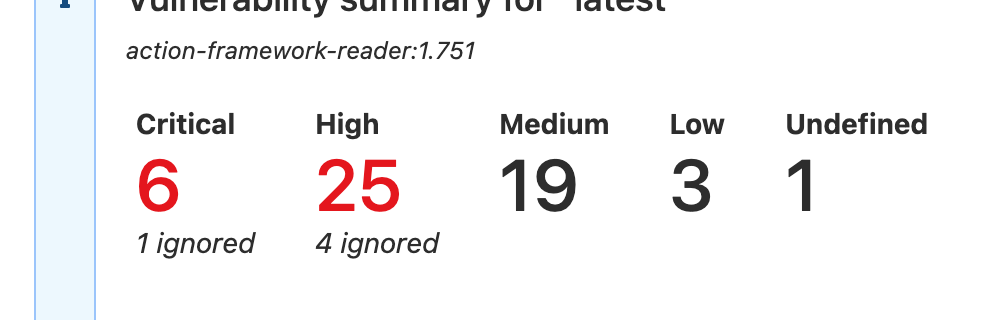
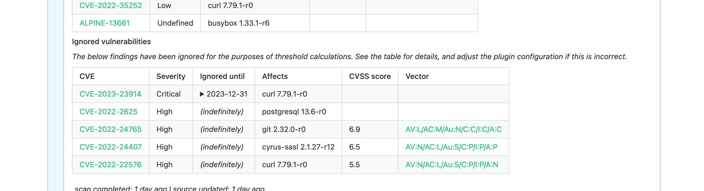
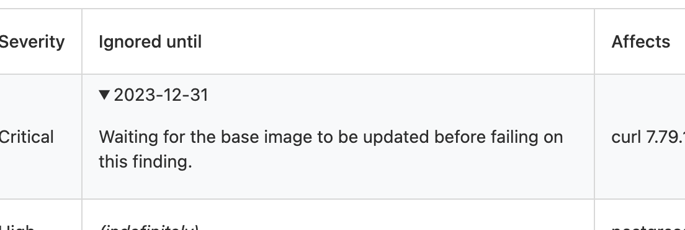

# Ignoring findings

Findings can be ignored using a YAML file with the following structure:

```yaml
ignores:
  - id: CVE-2023-100
  - id: CVE-2023-200
    until: 2023-12-31
    reason: allowing 2 weeks for base image to update
  - id: CVE-2023-300
```

- each element must have at least the `id` field
- the `until` field defines the expiry of this ignore entry. This allows a team time to respond while temporarily allowing builds to continue.
- the `reason` field gives a justification that is rendered in the annotation for greater visibility. Including the "why" in this field is highly recommended.

Ignore configuration can be specified in a number of places. If a listing for a finding with the same CVE name appears in multiple files, the most local wins: central configuration can be overridden by the repository.

From least to most important:

- `/etc/ecr-scan-results-buildkite-plugin/ignore.y[a]ml` (part of the agent, not modifiable by builds)
- `buildkite/ecr-scan-results-ignore.y[a]ml` (specified alongside the pipeline)
- `.buildkite/ecr-scan-results-ignore.y[a]ml`
- `.ecr-scan-results-ignore.y[a]ml` (local repository configuration)

Configuration in the `/etc/ecr-scan-results-buildkite-plugin` directory allows for organizations to ship agents with plugin configuration that centrally manages findings that can be ignored.

> [!IMPORTANT]
> When a finding is ignored, it is removed from consideration for threshold checks, but it's not discarded. The annotation created by the plugin adds details to the results, giving high visibility on the configured behaviour.

## Rendering

The summary counts at the top show the number of ignored findings:



Ignored findings are separated from the main list and shown at the bottom:



If a reason for ignoring a finding is provided, it's made available by expanding the Until date:


